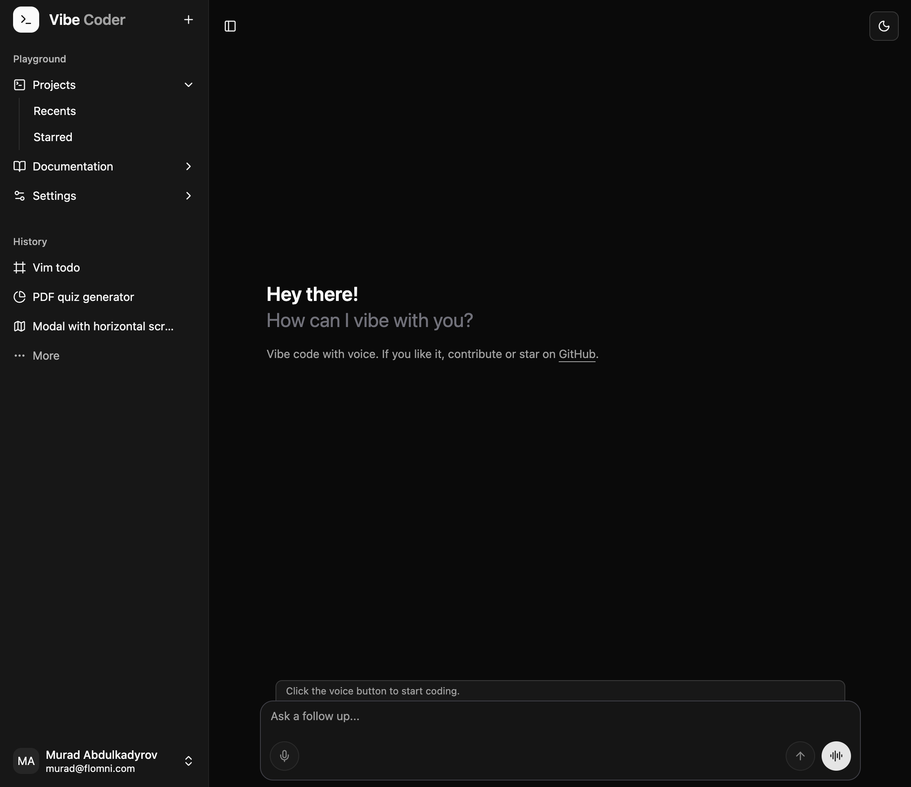

<a href="https://vibecoder-oss.vercel.app">
  
  <h1 align="center">Vibe Coder</h1>  
</a>

<p align="center">
  Realtime Voice AI Vibe Coder Built With Tanstack Start and OpenAI.
</p>

❗ This project is in very early development and lots of things will change.

<p align="center">
  <a href="#features"><strong>Features</strong></a> ·
  <a href="#model-provider"><strong>Model Provider</strong></a> ·
  <a href="#deploy-your-own"><strong>Deploy Your Own</strong></a> ·
  <a href="#running-locally"><strong>Running locally</strong></a>
</p>
<br/>

## Features

- [Tanstack Start](https://tanstack.com/start/latest)
  - File-based routing, type-safe from server to client
  - Built on Vite for a lightning-fast HMR development experience
  - Server-side rendering and client-side hydration
- [OpenAI](https://openai.com/)
  - Leverages OpenAI's powerful models for chat generation.
  - Direct API calls for text generation and other AI features.
- [Vercel Sandbox](https://vercel.com/docs/vercel-sandbox)
  - Securely executes untrusted or user-generated code in an isolated environment
  - Supports safe code execution and live previews for user or AI-generated code
- [Shadcn/ui](https://ui.shadcn.com)
  - Styling with [Tailwind CSS](https://tailwindcss.com)
  - Component primitives from [Radix UI](https://radix-ui.com) for accessibility and flexibility

## Model Provider

This app utilizes the [OpenAI API](https://openai.com/) for its AI capabilities. It is configured to use the following OpenAI models:

- Model (`gpt-4o-mini-realtime-preview`): Higher quality conversational model with higher latency.
- Model (`gpt-4.1`): General purpose model optimized for code generation.

## Deploy your own

You can deploy your own version of Vibe Coder to Vercel with one click:

[](https://vercel.com/new/clone?repository-url=https%3A%2F%2Fgithub.com%2Fmurabcd%2FVibeCoder&env=VITE_OPENAI_API_KEY&envDescription=You%27ll%20need%20an%20OpenAI%20API%20key.&envLink=https%3A%2F%2Fgithub.com%2Fmurabcd%2FVibeCoder%2Fblob%2Fmain%2F.env.example&demo-title=VibeCoder&demo-description=An%20Open-source%20Realtime%20AI%20Voice%20Agent%20Built%20With%20Tanstack%20Start%20and%20OpenAI.&demo-url=https%3A%2F%2Fvibecoder-oss.vercel.app)

## Running locally

You will need to use the environment variables [defined in `.env.example`](.env.example) to run Vibe Coder. It's recommended you use [Vercel Environment Variables](https://vercel.com/docs/projects/environment-variables) for this, but a `.env` file is all that is necessary.

> Note: You should not commit your `.env` file or it will expose secrets that will allow others to control access to your OpenAI account.

1. Install Vercel CLI: `bun i -g vercel`
2. Link local instance with Vercel and GitHub accounts (creates `.vercel` directory): `vercel link`
3. Download your environment variables: `vercel env pull`

```bash
bun install
bun dev
```

Your app should now be running on [localhost:3000](http://localhost:3000/).
